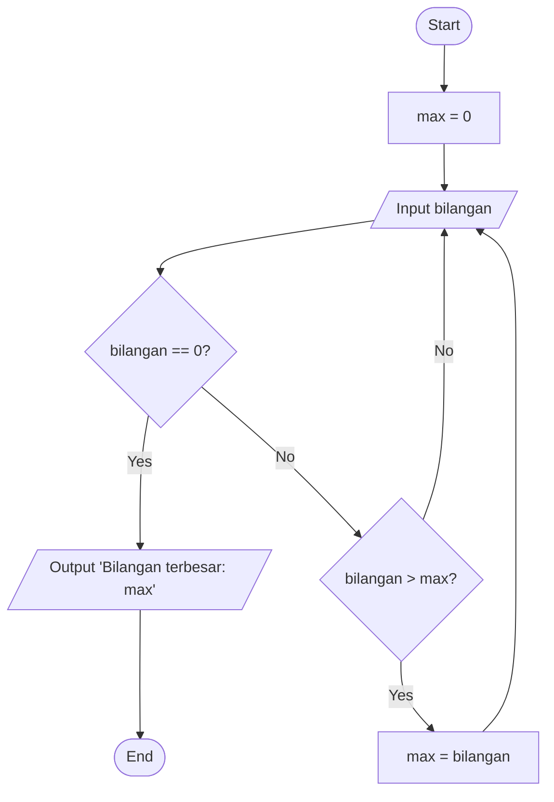

# Progam mencari bilangan terbesaar

progam sederhana uuntuk mencari nilai terbesar dari sekumpulan bilangan yang dimmasukan menggunakan loop while true dan break steatment.

## Deskripasi progam 

tujuan:

- Meminta pengguna untuk memasukkan sejumlah bilangan.
- Mencari bilangan terbesar dari kumpulan bilangan tersebut.
-  Menggunakan perulangan while True untuk terus meminta input hingga pengguna menginputkan nilai tertentu untuk menghentikan program.
- Menggunakan break untuk keluar dari perulangan ketika kondisi tertentu terpenuhi.

cara kerja

Inisialisasi:

- Membuat variabel untuk menyimpan nilai terbesar sementara (misalnya, max_number).
- Mengatur nilai awal max_number dengan bilangan yang sangat kecil sehingga bilangan inputan pertama pasti akan lebih besar.
- Perulangan while True:

- Meminta pengguna untuk memasukkan bilangan.
- Memeriksa apakah bilangan yang dimasukkan adalah nilai khusus untuk menghentikan program (misalnya, -1). Jika ya, maka break untuk keluar dari perulangan.
- Membandingkan bilangan yang dimasukkan dengan max_number.
- Jika bilangan yang dimasukkan lebih besar dari max_number, maka perbarui nilai max_number.
Output:

-Setelah perulangan selesai, cetak nilai terbesar yang telah ditemukan.

# Flowchart progam'



## kode program 

```python
max = 0                                              
while True:                                          
    bilangan = int(input("Masukan bilangan(0 untuk berhenti): "))  
    if bilangan == 0:                               
        break                                       
    if bilangan > max:                     
        max = bilangan                     
print(f"Bilangan terbesar: {max}")
```
## Output program 

Masukan bilangan(0 untuk berhenti): 5
Masukan bilangan(0 untuk berhenti): 9
Masukan bilangan(0 untuk berhenti): 3
Masukan bilangan(0 untuk berhenti): 12
Masukan bilangan(0 untuk berhenti): 7
Masukan bilangan(0 untuk berhenti): 0
Bilangan terbesar: 12

## Cara kerja program

Program ini dirancang untuk menemukan bilangan terbesar dari sekumpulan bilangan yang dimasukkan oleh pengguna. Program akan terus meminta input angka hingga pengguna memasukkan angka 0 sebagai tanda berhenti. Setiap angka yang dimasukkan akan dibandingkan dengan angka terbesar yang sudah ditemukan sebelumnya. Jika angka baru lebih besar, maka angka terbesar akan diperbarui. Setelah proses selesai, program akan menampilkan angka terbesar yang telah ditemukan.
